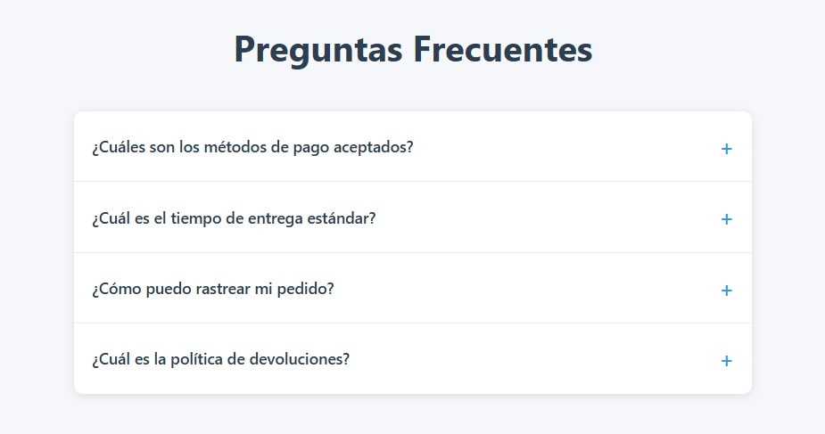

# FAQ Acordeón Interactivo

Un componente de Preguntas Frecuentes (FAQ) moderno e interactivo con animaciones suaves y diseño responsive. Perfecto para implementar en cualquier sitio web que necesite una sección de FAQ.

## 📋 Características

- Animaciones suaves de despliegue/contracción
- Diseño responsive para todos los dispositivos
- Estilo moderno con sombras y efectos visuales
- Sistema de acordeón (solo una respuesta visible a la vez)
- Rotación suave del ícono indicador
- Compatible con todos los navegadores modernos
- Sin dependencias externas
